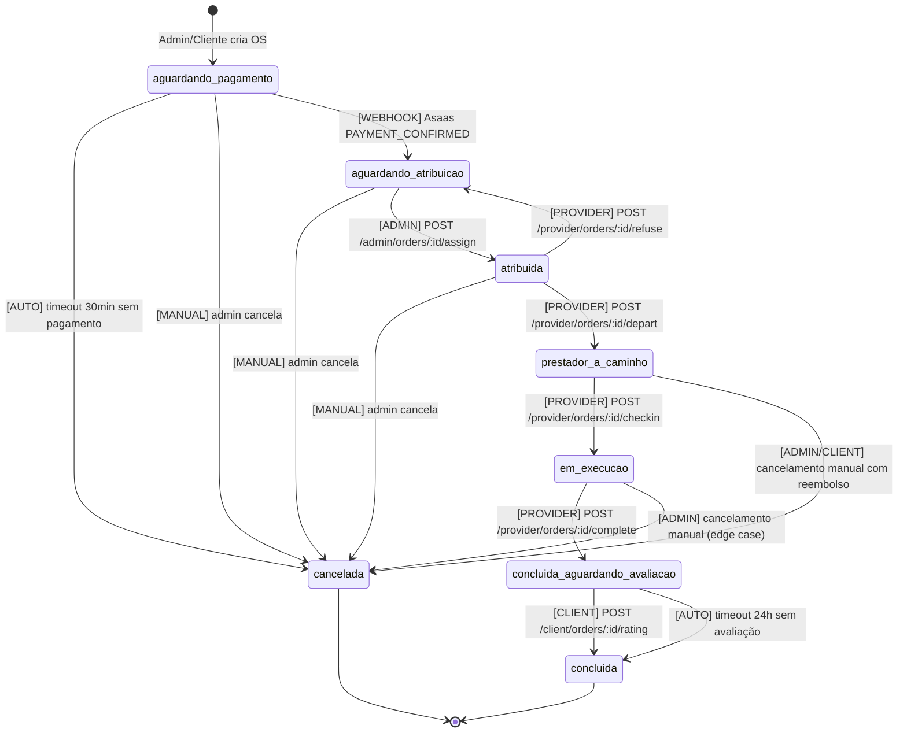

# CLEANOX — PLANO TÉCNICO DE SPRINT 0 (MVP)

**Versão:** 1.0 | **Data:** 2026-06-25

**Base de coerência:** ADR-001 (GPS+a_caminho) · ADR-002 (Asaas+split+Pix) · ADR-003 (PWA/Flutter/Next.js/Fastify+PG+Redis)

---

## 1. MODELO DE DADOS MVP

> Campos marcados com `[ENC]` = criptografados em repouso (AES-256-GCM, chave por tenant no KMS). Campos `[HASH]` = HMAC-SHA256 para busca. Todas as tabelas têm `created_at`/`updated_at` implícitos. IDs = UUID v7 (ordenável por tempo).

### users
*Identidade unificada para clientes, prestadores e atendentes/admins*

```sql
id UUID PK
phone [ENC] TEXT NOT NULL UNIQUE  -- chave de login
phone_hash [HASH] TEXT NOT NULL UNIQUE  -- índice de busca
role TEXT NOT NULL CHECK (role IN ('client','provider','attendant','admin'))
full_name [ENC] TEXT
email [ENC] TEXT
cpf [ENC] TEXT  -- somente prestadores
cpf_hash [HASH] TEXT  -- índice
status TEXT NOT NULL DEFAULT 'active' CHECK (status IN ('active','suspended','banned'))
otp_code TEXT  -- armazenado temporariamente, 6 dígitos, TTL via Redis
otp_expires_at TIMESTAMPTZ
fcm_token TEXT  -- device token FCM (atualizado pelo app)
created_at TIMESTAMPTZ NOT NULL DEFAULT now()
updated_at TIMESTAMPTZ NOT NULL DEFAULT now()
```

### providers
*Dados extras dos prestadores (extensão de users)*

```sql
id UUID PK REFERENCES users(id)
pix_key_type TEXT CHECK (pix_key_type IN ('cpf','email','phone','random'))
pix_key [ENC] TEXT  -- chave Pix para repasse
asaas_contact_id TEXT  -- ID do contato no Asaas para split/transfer
coverage_zones TEXT[]  -- bairros/regiões de cobertura
service_types TEXT[]  -- tipos aceitos: ['apt','house','office']
rating_avg NUMERIC(3,2) DEFAULT 0
rating_count INTEGER DEFAULT 0
flag_count INTEGER DEFAULT 0  -- contador de flags anti-desvio confirmadas
gps_off_count INTEGER DEFAULT 0  -- contador desligamentos de GPS em OS ativa
suspension_until TIMESTAMPTZ  -- nulo = ativo
suspension_reason TEXT
suspension_reviewer_id UUID REFERENCES users(id)  -- quem aplicou (human)
```

### clients
*Dados extras dos clientes*

```sql
id UUID PK REFERENCES users(id)
rating_avg NUMERIC(3,2) DEFAULT 5
order_count INTEGER DEFAULT 0
last_order_at TIMESTAMPTZ  -- para detecção de recompra anômala
```

### service_catalog
*Catálogo de tipos de serviço (configurável pelo admin)*

```sql
id UUID PK
slug TEXT NOT NULL UNIQUE  -- 'apt', 'house', 'office'
label TEXT NOT NULL  -- 'Apartamento', 'Casa', 'Escritório'
min_duration_hours NUMERIC(4,2) NOT NULL  -- 2, 3, 4
price_base NUMERIC(10,2) NOT NULL
price_max NUMERIC(10,2)
active BOOLEAN DEFAULT true
sort_order INTEGER DEFAULT 0
```

### system_params
*Parâmetros globais configuráveis pelo admin (chave-valor)*

```sql
key TEXT PK  -- ex: 'platform_fee_pct', 'holdback_hours', 'payment_timeout_min'
value TEXT NOT NULL
description TEXT
updated_at TIMESTAMPTZ NOT NULL DEFAULT now()
updated_by UUID REFERENCES users(id)
```

**Valores iniciais:**

| Chave | Valor padrão |
|-------|-------------|
| `platform_fee_pct` | 10 |
| `holdback_hours` | 24 |
| `payment_timeout_min` | 30 |
| `anomaly_threshold_days` | 30 |
| `gps_checkin_radius_m` | 300 |
| `provider_invite_timeout_min` | 30 |

### service_orders
*Ordem de Serviço — entidade central*

```sql
id UUID PK
order_number SERIAL UNIQUE  -- número legível (#122)
client_id UUID NOT NULL REFERENCES users(id)
provider_id UUID REFERENCES users(id)  -- nulo até atribuição
service_type_id UUID NOT NULL REFERENCES service_catalog(id)
status TEXT NOT NULL DEFAULT 'aguardando_pagamento' CHECK (status IN (
  'aguardando_pagamento','aguardando_atribuicao','atribuida',
  'prestador_a_caminho','em_execucao',
  'concluida_aguardando_avaliacao','concluida','cancelada'
))
scheduled_at TIMESTAMPTZ NOT NULL
started_at TIMESTAMPTZ  -- check-in (cheguei)
completed_at TIMESTAMPTZ  -- check-out (concluído)
address_token_id UUID REFERENCES address_tokens(id)
location_neighborhood TEXT NOT NULL  -- bairro (público ao prestador)
location_city TEXT NOT NULL
instructions TEXT  -- observações do cliente (máx 500 chars)
gross_amount NUMERIC(10,2) NOT NULL
platform_fee NUMERIC(10,2) NOT NULL
provider_net NUMERIC(10,2) NOT NULL
payment_id UUID REFERENCES payments(id)
transfer_id UUID REFERENCES transfers(id)
cancellation_reason TEXT
cancelled_by TEXT CHECK (cancelled_by IN ('system_timeout','client','admin'))
created_by UUID NOT NULL REFERENCES users(id)
assigned_by UUID REFERENCES users(id)
```

**Índices:** `status + scheduled_at` · `client_id + status` · `provider_id + scheduled_at` · `payment_id`

### address_tokens
*Endereços efêmeros — desacoplados da OS para minimização de PII*

```sql
id UUID PK
order_id UUID NOT NULL REFERENCES service_orders(id)
lat [ENC] NUMERIC(10,7) NOT NULL
lng [ENC] NUMERIC(10,7) NOT NULL
full_address [ENC] TEXT NOT NULL  -- rua, número, complemento, CEP
jwt_jti UUID NOT NULL UNIQUE  -- claim jti para revogação via Redis
issued_at TIMESTAMPTZ NOT NULL DEFAULT now()
expires_at TIMESTAMPTZ NOT NULL
revoked_at TIMESTAMPTZ  -- preenchido no check-out ou cancelamento
```

> `lat`/`lng` para exibição no mapa (pin sem endereço textual) retornado ao prestador somente após aceite. `full_address` somente para admin e logs.

### gps_events
*Posições GPS do prestador durante OS ativa — TTL 48h*

```sql
id UUID PK
order_id UUID NOT NULL REFERENCES service_orders(id)
provider_id UUID NOT NULL REFERENCES users(id)
lat NUMERIC(10,7) NOT NULL
lng NUMERIC(10,7) NOT NULL
accuracy_m NUMERIC(6,1)
recorded_at TIMESTAMPTZ NOT NULL
expires_at TIMESTAMPTZ NOT NULL  -- recorded_at + 48h (cron de purge)
```

**Índice:** `order_id + recorded_at DESC`

> Nenhum dado GPS salvo fora de OS ativa (status IN ('prestador_a_caminho','em_execucao')). Cron diário purga rows com `expires_at < now()`.

### payments
*Cobranças no Asaas*

```sql
id UUID PK
order_id UUID NOT NULL REFERENCES service_orders(id)
asaas_payment_id TEXT NOT NULL UNIQUE
billing_type TEXT NOT NULL DEFAULT 'PIX'
amount NUMERIC(10,2) NOT NULL
status TEXT NOT NULL DEFAULT 'PENDING' CHECK (status IN (
  'PENDING','CONFIRMED','RECEIVED','REFUNDED','OVERDUE','CANCELLED'
))
pix_qr_code TEXT
pix_expiry TIMESTAMPTZ
confirmed_at TIMESTAMPTZ
webhook_last_event JSONB
idempotency_key TEXT NOT NULL UNIQUE  -- order_id + attempt
```

### transfers
*Repasses Pix ao prestador via Asaas Transfer*

```sql
id UUID PK
order_id UUID NOT NULL REFERENCES service_orders(id)
provider_id UUID NOT NULL REFERENCES users(id)
asaas_transfer_id TEXT UNIQUE
amount NUMERIC(10,2) NOT NULL  -- provider_net
status TEXT NOT NULL DEFAULT 'PENDING' CHECK (status IN (
  'PENDING','BANK_PROCESSING','DONE','FAILED','CANCELLED'
))
scheduled_at TIMESTAMPTZ NOT NULL  -- completed_at + holdback_hours
executed_at TIMESTAMPTZ
failure_reason TEXT
idempotency_key TEXT NOT NULL UNIQUE  -- order_id + 'transfer'
```

### ratings
*Avaliações pós-serviço do cliente*

```sql
id UUID PK
order_id UUID NOT NULL REFERENCES service_orders(id) UNIQUE
client_id UUID NOT NULL REFERENCES users(id)
provider_id UUID NOT NULL REFERENCES users(id)
stars INTEGER NOT NULL CHECK (stars BETWEEN 1 AND 5)
comment TEXT
flag_asked_contact BOOLEAN NOT NULL DEFAULT false
flag_asked_direct_payment BOOLEAN NOT NULL DEFAULT false
flag_offered_off_platform BOOLEAN NOT NULL DEFAULT false
any_flag BOOLEAN GENERATED ALWAYS AS (
  flag_asked_contact OR flag_asked_direct_payment OR flag_offered_off_platform
) STORED
ip_address TEXT
user_agent TEXT
created_at TIMESTAMPTZ NOT NULL DEFAULT now()
```

### desvio_alerts
*Alertas gerados por flags anti-desvio ou padrão anômalo — NÃO geram ação automática*

```sql
id UUID PK
alert_type TEXT NOT NULL CHECK (alert_type IN (
  'flag_anti_desvio','gps_desligado','anomalia_recompra','padrão_fuga'
))
severity TEXT NOT NULL CHECK (severity IN ('low','medium','high'))
order_id UUID REFERENCES service_orders(id)
provider_id UUID REFERENCES users(id)
client_id UUID REFERENCES users(id)
description TEXT NOT NULL
evidence JSONB  -- flags marcadas, timestamps, coordenadas
status TEXT NOT NULL DEFAULT 'open' CHECK (status IN (
  'open','under_review','resolved_action','resolved_noaction'
))
reviewed_by UUID REFERENCES users(id)  -- obrigatório para fechar
review_notes TEXT
reviewed_at TIMESTAMPTZ
created_at TIMESTAMPTZ NOT NULL DEFAULT now()
```

### order_photos
*Fotos antes/depois do serviço*

```sql
id UUID PK
order_id UUID NOT NULL REFERENCES service_orders(id)
provider_id UUID NOT NULL REFERENCES users(id)
photo_type TEXT NOT NULL CHECK (photo_type IN ('before','after'))
storage_url [ENC] TEXT NOT NULL
lat NUMERIC(10,7)
lng NUMERIC(10,7)
taken_at TIMESTAMPTZ NOT NULL
created_at TIMESTAMPTZ NOT NULL DEFAULT now()
```

### rpa_records
*Registro de RPA emitido manualmente*

```sql
id UUID PK
order_id UUID NOT NULL REFERENCES service_orders(id)
provider_id UUID NOT NULL REFERENCES users(id)
gross_amount NUMERIC(10,2) NOT NULL
inss_retention NUMERIC(10,2)  -- validar % com contador
irrf_retention NUMERIC(10,2)  -- validar % com contador
net_amount NUMERIC(10,2) NOT NULL
pdf_url [ENC] TEXT
competencia DATE NOT NULL
issued_at TIMESTAMPTZ
issued_by UUID REFERENCES users(id)
```

### nfse_records
*NFS-e emitida manualmente pela empresa*

```sql
id UUID PK
order_id UUID NOT NULL REFERENCES service_orders(id)
nfse_number TEXT NOT NULL
municipality TEXT NOT NULL
service_code TEXT NOT NULL  -- código LCBR 14.01 (limpeza)
iss_value NUMERIC(10,2)
gross_value NUMERIC(10,2) NOT NULL
issued_at DATE NOT NULL
pdf_url [ENC] TEXT
registered_by UUID NOT NULL REFERENCES users(id)
```

### audit_log
*Log append-only imutável — nunca DELETE/UPDATE nesta tabela*

```sql
id UUID PK DEFAULT gen_random_uuid()
ts TIMESTAMPTZ NOT NULL DEFAULT now()
actor_id UUID  -- quem agiu (nulo = sistema)
actor_role TEXT
action TEXT NOT NULL  -- ex: 'order.status_changed', 'provider.suspended'
entity_type TEXT NOT NULL  -- 'order','provider','client','payment'
entity_id UUID NOT NULL
prev_state JSONB
next_state JSONB
ip_address TEXT
metadata JSONB
```

> Implementação: RLS com `INSERT` apenas, sem `UPDATE`/`DELETE`. Trigger em `service_orders.status` para gravação automática. Política PostgreSQL: `REVOKE DELETE, UPDATE ON audit_log FROM app_role`.

---

## 2. MÁQUINA DE ESTADOS DA OS



### Transições Detalhadas

| De | Para | Gatilho | Efeitos Colaterais |
|----|------|---------|-------------------|
| `aguardando_pagamento` | `cancelada` | Job scheduler após `payment_timeout_min` | audit_log · FCM push ao cliente · payment.status → OVERDUE |
| `aguardando_pagamento` | `aguardando_atribuicao` | POST /webhooks/asaas/payment (PAYMENT_CONFIRMED) | payment.confirmed_at · audit_log · FCM push ao cliente |
| `aguardando_atribuicao` | `atribuida` | POST /admin/orders/:id/assign | order.provider_id · audit_log · FCM push ao prestador e cliente |
| `atribuida` | `aguardando_atribuicao` | POST /provider/orders/:id/refuse | order.provider_id = NULL · audit_log · FCM ao admin · **SEM penalidade automática** |
| `atribuida` | `prestador_a_caminho` | POST /provider/orders/:id/depart | GPS_TRACKING_START · FCM push ao cliente · audit_log |
| `prestador_a_caminho` | `em_execucao` | POST /provider/orders/:id/checkin + foto_before | order.started_at · order_photos INSERT · FCM ao cliente · audit_log · **Guard: GPS ≤ 300m do destino** |
| `em_execucao` | `concluida_aguardando_avaliacao` | POST /provider/orders/:id/complete + foto_after | order.completed_at · GPS_TRACKING_STOP · address_token revogado · split/repasse agendado · FCM ao cliente · audit_log |
| `concluida_aguardando_avaliacao` | `concluida` | POST /client/orders/:id/rating OU timeout 24h | ratings INSERT · providers.rating_avg recalculado · SE any_flag: desvio_alerts INSERT + FCM ao admin · audit_log |

**Eventos GPS off:** Se `/provider/location` parar por > 5 min durante OS ativa: `desvio_alerts INSERT` (type=gps_desligado, severity=medium) + `providers.gps_off_count++`. **SEM ação automática sobre a OS.**

---

## 3. CONTRATOS DE API (REST)

**Base URL:** `https://api.cleanox.com.br/v1`  
**Auth:** Bearer JWT (RS256). Claims: `sub=user_id`, `role`, `exp`. Refresh via `/auth/refresh`.

> **CONTRATO DE MINIMIZAÇÃO DE PII:** Endpoints do prestador NUNCA retornam `phone`, `email`, `full_address`, `cpf` do cliente. Endpoints do cliente NUNCA retornam `phone`, `email`, `cpf`, `pix_key` do prestador.

### Auth / OTP

| Método | Endpoint | Auth | Notas |
|--------|----------|------|-------|
| POST | `/auth/otp/send` | none | Rate limit: 3 req/hora por (IP + phone). Código 6 dígitos, hash no Redis TTL 5min |
| POST | `/auth/otp/verify` | none | Retorna `access_token` (1h) + `refresh_token` (30d). Cria user se não existir (role=client) |
| POST | `/auth/refresh` | none (refresh_token no body) | Refresh token rotacionado a cada uso |
| POST | `/auth/logout` | Bearer | Revoga refresh_token, limpa FCM token |

### Cliente (PWA) — role: `client`

| Método | Endpoint | Notas |
|--------|----------|-------|
| GET | `/client/catalog` | Público. Retorna serviços ativos |
| GET | `/client/slots?date=&service_type_id=` | Janelas de 2h entre 8h–18h, exclui slots ocupados |
| POST | `/client/orders` | Cria OS + address_token + cobrança Asaas Pix. Body: `service_type_id, scheduled_at, lat, lng, neighborhood, city, instructions` |
| GET | `/client/orders/:id` | Retorna status, map_pin (lat/lng), provider.display_name, payment_status. **Nunca phone/cpf do prestador** |
| GET | `/client/orders/:id/tracking` | GPS atual do prestador. Retorna null se status não for `prestador_a_caminho` ou `em_execucao` |
| DELETE | `/client/orders/:id` | Cancelamento. Permitido somente se status IN ('aguardando_pagamento','aguardando_atribuicao','atribuida') E scheduled_at > now()+1h |
| POST | `/client/orders/:id/rating` | `stars (1-5), comment, flag_asked_contact, flag_asked_direct_payment, flag_offered_off_platform`. Uma única avaliação por OS |
| GET | `/client/orders` | Histórico paginado |

### Prestador (App) — role: `provider`

| Método | Endpoint | Notas |
|--------|----------|-------|
| GET | `/provider/orders?date=` | Lista OS do dia. **Retorna apenas: neighborhood, city, gross_amount, provider_net, client_rating_avg — nunca phone/cpf do cliente** |
| GET | `/provider/orders/:id` | Detalhe. map_pin (lat/lng) retornado APENAS se status IN ('atribuida','prestador_a_caminho','em_execucao'). Sem rua/número/nome/telefone do cliente |
| POST | `/provider/orders/:id/refuse` | Retorna OK. **Nenhum campo de penalidade atualizado (ADR-004 / anti-subordinação)** |
| POST | `/provider/orders/:id/depart` | Inicia GPS tracking |
| POST | `/provider/location` | Body: `{order_id, lat, lng, accuracy_m, recorded_at}`. Aceita batch de até 10 pontos. Rejeita silenciosamente fora de OS ativa |
| POST | `/provider/orders/:id/checkin` | Body: `{lat, lng, photo_before_url}`. Guard: distância ≤ `gps_checkin_radius_m` |
| POST | `/provider/orders/:id/complete` | Body: `{lat, lng, photo_after_url}`. Retorna `transfer_scheduled_at` |
| GET | `/provider/earnings?period=today\|month\|all` | Histórico de repasses |
| PATCH | `/provider/profile` | Atualiza pix_key, coverage_zones |
| POST | `/provider/photos/upload-url` | Retorna presigned PUT URL (TTL 10min) para upload direto ao storage |

### Admin / Atendente

| Método | Endpoint | Role | Notas |
|--------|----------|------|-------|
| GET | `/admin/leads` | attendant,admin | Lista clientes com OS pendentes. Telefone mascarado para attendant |
| POST | `/admin/orders` | attendant,admin | Cria OS pelo painel com full_address |
| PATCH | `/admin/orders/:id` | attendant,admin | Edita OS (somente em status antes de atribuição) |
| GET | `/admin/orders` | attendant,admin | Kanban. Filtros: status, date, provider_id |
| GET | `/admin/orders/:id` | attendant,admin | Detalhe completo. `full_address` somente para admin |
| POST | `/admin/orders/:id/assign` | attendant,admin | Atribui prestador. Guard: provider.status = 'active' |
| DELETE | `/admin/orders/:id` | admin | Cancela OS. Motivo obrigatório |
| GET | `/admin/providers` | attendant,admin | Lista prestadores com status, rating, flag_count |
| POST | `/admin/providers` | admin | Cria prestador. Envia SMS onboarding automaticamente |
| POST | `/admin/providers/:id/suspend` | admin | **Suspensão EXCLUSIVAMENTE manual**. Requer `reason` (mín 20 chars) e `alert_id`. Registra `reviewed_by = actor` no audit_log |
| POST | `/admin/providers/:id/unsuspend` | admin | Reativa prestador. Requer `reason` |
| GET | `/admin/alerts` | admin | Lista alertas. Filtros: status, type |
| PATCH | `/admin/alerts/:id` | admin | Fecha alerta com `status` e `review_notes`. `reviewer_id` preenchido automaticamente |
| GET | `/admin/financials` | admin | Dashboard financeiro + lista de suspeitos de desvio |
| GET | `/admin/params` | admin | Lista parâmetros globais |
| PATCH | `/admin/params/:key` | admin | Atualiza parâmetro. Validação por key. Audit_log obrigatório |
| GET | `/admin/audit` | admin | Log imutável paginado. Filtros: entity_type, entity_id, actor_id, from, to |

### Webhooks Asaas

> Auth via HMAC-SHA256 do body com chave secreta do Asaas (header: `asaas-signature`). Idempotência via Redis `SET NX` com TTL 24h.

| Endpoint | Eventos relevantes | Processamento |
|----------|-------------------|---------------|
| POST `/webhooks/asaas/payment` | PAYMENT_CONFIRMED, PAYMENT_RECEIVED, PAYMENT_OVERDUE, PAYMENT_REFUNDED | Validar signature → idempotency check → atualizar payment.status → transição OS → FCM push → audit_log |
| POST `/webhooks/asaas/transfer` | TRANSFER_DONE, TRANSFER_FAILED | Validar signature → idempotency check → atualizar transfer.status → FCM push ao prestador (DONE) ou alerta admin (FAILED) → audit_log |

---

## 4. INTEGRAÇÕES DE BORDA

### Asaas (Pagamentos, Split, Repasse)

**Base URL:** `https://api.asaas.com/v3` (prod) | `https://sandbox.asaas.com/api/v3` (sandbox)  
**Auth:** Header `access_token: $ASAAS_API_KEY`

**Criar cobrança (POST /payments):**
```json
{
  "customer": "asaas_customer_id do cliente",
  "billingType": "PIX",
  "value": "gross_amount",
  "dueDate": "scheduled_at + payment_timeout_min",
  "externalReference": "order_id",
  "description": "Cleanox - {service_label} #{order_number}"
}
```

> Split da cobrança NÃO usado no MVP. O repasse ao prestador é feito via Transfer separado após conclusão.

**Criar repasse (POST /transfers):**
```json
{
  "operationType": "PIX",
  "pixAddressKey": "provider.pix_key",
  "pixAddressKeyType": "provider.pix_key_type",
  "value": "transfer.amount (provider_net)",
  "description": "Repasse Cleanox OS #{order_number} - {competencia}",
  "externalReference": "transfer_id"
}
```

> Timing: agendado para `completed_at + holdback_hours` (param configurável, default 24h).

**Reconciliação:** Job diário (cron 23:00) verifica payments/transfers com status PENDING há > 2h.

---

### FCM (Firebase Cloud Messaging)

**SDK:** `google-auth-library` + HTTP v1 API  
**Autenticação:** OAuth2 service account → POST `https://fcm.googleapis.com/v1/projects/{id}/messages:send`

| Evento | Target | Título | Corpo |
|--------|--------|--------|-------|
| `order.atribuida` | provider | "Novo chamado!" | "Apartamento em {neighborhood} às {time}" |
| `order.prestador_a_caminho` | client | "Prestador a caminho!" | "{provider_first_name} saiu em direção ao seu local" |
| `order.em_execucao` | client | "Serviço iniciado!" | "Seu prestador chegou e já começou" |
| `order.concluida_aguardando_avaliacao` | client | "Serviço concluído!" | "Como foi a experiência? Avalie em 2 minutos" |
| `transfer.done` | provider | "Repasse enviado!" | "R$ {amount} enviado para sua chave Pix" |
| `alert.new` | admin | "Alerta: {alert_type}" | "{description}" |

**Fallback:** Se FCM retornar 404 (token inválido) → limpar `fcm_token` do user.

---

### Google Maps

| API | Uso | Quando |
|-----|-----|--------|
| Geocoding API | Admin insere endereço textual → obter lat/lng | Criação de OS no painel admin |
| Directions API | Calcular ETA do prestador ao destino | status = prestador_a_caminho, a cada update GPS |
| Maps JavaScript API | Mapa no PWA cliente | Tela de acompanhamento |
| Flutter google_maps_flutter | Mapa no app prestador | Tela Estou a Caminho |

**Política de chave API:** Chave com restrição de IP (backend) e restrição de bundle/origin (mobile/PWA). Chaves separadas por superfície.

**Política de GPS:** Ativo APENAS quando `order.status IN ('prestador_a_caminho','em_execucao')`. App Flutter: `Geolocator` com `distanceFilter: 20m`. Parar stream no check-out.

---

### SMS OTP

**Provedor sugerido:** Zenvia (BR, boa cobertura) ou AWS SNS (custo menor)  
**Fluxo:** `/auth/otp/send` → API do provedor → OTP como HMAC no Redis (TTL 300s) → verificação via HMAC compare  
**Rate limiting:** Redis: incrementar por (phone_hash + IP), resetar a cada hora. Bloquear após 3 tentativas/hora.  
**Código:** 6 dígitos numéricos via `crypto.randomInt(100000, 999999)`

---

### Object Storage (Fotos e PDFs)

**Sugestão:** AWS S3 ou Cloudflare R2 (egress gratuito, melhor para BR)  
**Política:** Bucket privado. Acesso via URLs pre-assinadas (TTL 1h). Nunca URLs públicas permanentes.  
**Retenção:** Fotos de OS: 2 anos (disputas). PDFs RPA/NFS-e: 5 anos (fiscal).

---

### NFS-e e RPA (Manual no MVP)

**NFS-e:** 100% manual. Admin emite no portal do município após conclusão da OS e registra número via endpoint de admin. ISS varia por município — configurar `service_code` e alíquota por cidade.

**RPA:** Gerado por template HTML → PDF (Puppeteer/node-html-pdf). Template pré-formatado com: nome prestador, CPF, OS número, valor bruto, retenções (INSS, IRRF), valor líquido, competência, assinatura admin. Armazenado no object storage.

> **GATE:** Percentuais de INSS/IRRF dependem de validação com contador. Não hardcodar no Sprint 0.

---

## 5. TOKEN DE ENDEREÇO EFÊMERO

**Mecanismo:** JWT assinado RS256 (chave privada no servidor, rotacionada mensalmente via KMS)

**Claims JWT:**

| Claim | Valor |
|-------|-------|
| `sub` | `order_id` (UUID) |
| `type` | `address_token` |
| `jti` | UUID único (para revogação em Redis) |
| `iat` | Unix timestamp de emissão |
| `exp` | `scheduled_at + 4h` (janela: 1h antes até checkout + buffer) |
| `visible_to` | `['provider', 'admin']` |
| `addr_enc` | `AES-256-GCM({lat, lng, full_address}, order_key)` em base64 |

**Ciclo de vida:**

1. **EMISSÃO:** address_token criado quando OS é criada. JWT gerado + jti registrado em Redis (`SETNX address_token:{jti} 'active' EX <ttl>`).
2. **ACESSO PELO PRESTADOR:** `GET /provider/orders/:id` retorna `{lat, lng}` (sem full_address) somente após `order.status = 'atribuida'`. Backend decripta, verifica Redis jti = 'active', retorna apenas lat/lng.
3. **ACESSO PELO ADMIN:** `GET /admin/orders/:id` retorna lat, lng e full_address. Mesmo check de revogação.
4. **REVOGAÇÃO NO CHECK-OUT:** Quando `order → concluida_aguardando_avaliacao`: Redis `SET address_token:{jti} 'revoked'`. `address_tokens.revoked_at = now()`. Chamadas posteriores retornam 410 Gone.
5. **REVOGAÇÃO NO CANCELAMENTO:** Mesma lógica do check-out.
6. **EXPIRAÇÃO NATURAL:** JWT exp + Redis TTL como fallback de segurança.

**Garantia no cliente:**

- **PWA React:** lat/lng mantidos apenas em React state (memória). Nunca em localStorage, sessionStorage ou IndexedDB. Endereço textual nunca renderizado no DOM do cliente.
- **App Flutter:** Coordenadas em Riverpod/Provider state (memória). Nenhuma escrita em SharedPreferences ou SQLite. Após check-out ou cancelamento: limpar state imediatamente.
- **Prestador não vê texto:** `full_address` nunca enviado ao app prestador. Apenas lat/lng para pin no mapa.

---

## 6. ADR-004: Bloqueio de Prestador — Revisão Humana Obrigatória

**Status:** ACEITO | **Data:** 2026-06-25

### Contexto

O documento `07-fluxos-mvp.md` propõe bloqueio automático via sistema: "2+ flags anti-desvio confirmadas → bloqueio 30 dias (1ª vez)" e "Desligamento de GPS 3+ vezes → 30 dias". Isso conflita com as regras anti-risco-trabalhista: "NUNCA punição/dedução automática" e "recusa sem consequência automática".

### Conflito

Bloqueio algorítmico automático (baseado em contagem de flags) é um mecanismo de controle comportamental que caracteriza subordinação. Em eventual reclamação trabalhista, demonstrar que o sistema pune automaticamente por descumprimento de "regras de conduta" é evidência de vínculo empregatício (controle direto sobre o modo de trabalho).

### Decisão

**BLOQUEIO AUTOMÁTICO PROIBIDO NA ARQUITETURA.**

**O que o SISTEMA faz:**
1. Gera `desvio_alert` com severity e evidence (flags, GPS log, fotos).
2. Envia FCM/email imediato ao admin.
3. Incrementa contadores (`flag_count`, `gps_off_count`) para suporte à decisão humana.
4. Exibe alertas e contadores no painel admin.

**O que o HUMANO (admin) faz:**
1. Revisa evidências (fotos antes/depois, trilha GPS, flags do cliente, audit_log).
2. Decide: resolver sem ação / suspender temporariamente / banir.
3. Executa `POST /admin/providers/:id/suspend` com `reason` obrigatório (mín 20 chars) e referência ao `alert_id`.
4. Decisão registrada no audit_log com `human_reviewer_id = admin autenticado`.

### Consequências para o Produto

- A UX do painel deve remover qualquer texto que sugira "bloqueio automático". Substituir por "Abrir investigação" → tela de revisão → "Aplicar suspensão".
- O aviso ao prestador ("Qualquer desvio = bloqueio") deve ser suavizado para "Qualquer desvio será investigado e pode resultar em suspensão da parceria".
- Contador de flags é visível internamente ao admin; nunca exposto ao prestador como threshold.
- Nenhuma coluna `auto_block_at` ou similar no banco de dados.

### Justificativa Legal

A decisão editorial de suspender uma parceria comercial pertence à empresa e deve ser exercida por um ser humano responsável. Isso é consistente com a natureza de prestador autônomo informal e mitiga o passivo trabalhista #1 identificado no backlog.

---

## 7. PLANO DE SPRINTS ATÉ MVP

**Duração por sprint:** 2 semanas | **Total estimado:** 14 semanas (7 sprints)  
**Equipe:** 2 backend, 1 frontend web, 1 Flutter, 1 tech lead/arquiteto (part-time)

### Sprint 0 — Fundação (Semanas 1–2)

**Épico:** Infra

| Entrega |
|---------|
| Repositórios: monorepo ou repos separados (api/, pwa/, app/, panel/) |
| PostgreSQL + Redis provisionados (Docker local + staging cloud) |
| Node.js + Fastify scaffold com plugins: auth JWT, rate-limit, cors, helmet |
| Migrations iniciais: users, providers, clients, service_catalog, system_params, audit_log |
| CI/CD básico (GitHub Actions): lint + type-check + migration check |
| Conta Asaas sandbox criada + webhook endpoint stub |
| Projeto FCM criado + service account configurado |
| Google Maps API keys criadas (restrições por surface) |
| Provedor SMS OTP contratado + integração de envio testada |
| Object storage bucket criado (privado, lifecycle policy definida) |
| KMS/secrets vault configurado (AWS Secrets Manager ou Doppler) |
| Health check endpoint: `GET /health → {status: ok, db: ok, redis: ok}` |
| Seed de system_params com valores iniciais |
| Seed de service_catalog (apt/house/office) |

**Gate de saída:** Deploy de staging respondendo /health. Migrations aplicadas. Asaas sandbox conectado.

---

### Sprint 1 — Auth + OS Básica + Pagamento (Semanas 3–4)

**Épicos:** A (Auth) · B (Cadastro Cliente) · C (Agendamento/Catálogo) · D (Pagamento)

| Entrega |
|---------|
| POST /auth/otp/send + /verify + /refresh + /logout |
| GET /client/catalog |
| GET /client/slots (lógica de janelas simples) |
| POST /client/orders (cria OS + address_token + cobrança Asaas Pix) |
| GET /client/orders/:id (status + payment + map_pin sem endereço textual) |
| POST /webhooks/asaas/payment (CONFIRMED → aguardando_atribuicao) |
| Job de timeout de pagamento (30min → cancelada) |
| PWA: Tela 1 (Landing/OTP) + Tela 2 (Agendar) + Tela 3 (Confirmar + QR Pix) |

---

### Sprint 2 — Prestador + Atribuição Manual (Semanas 5–6)

**Épicos:** B (Cadastro Prestador) · E (Atribuição Manual)

| Entrega |
|---------|
| Onboarding prestador: OTP flow + POST /provider/profile (pix_key, coverage_zones) |
| GET /provider/orders (lista OS do dia) |
| GET /provider/orders/:id (detalhe pré-aceite, sem endereço) |
| POST /provider/orders/:id/refuse (sem penalidade) |
| POST /admin/orders (criar OS pelo painel) |
| GET /admin/leads + GET /admin/orders (kanban básico) |
| POST /admin/orders/:id/assign → FCM push ao prestador |
| POST /admin/providers (criar prestador + SMS onboarding) |
| App Flutter: Telas 0a–0d (onboarding) + Tela 1 (Lista OS) + Tela 2 (Detalhe pré-aceite) |
| Painel Next.js: Tela 3 (Criar OS) + Tela 4 (Atribuição Manual) |

---

### Sprint 3 — GPS + Execução do Serviço (Semanas 7–8)

**Épicos:** F (GPS + a caminho) · G (Check-in/Check-out)

| Entrega |
|---------|
| POST /provider/orders/:id/depart (→ prestador_a_caminho + GPS ativo) |
| POST /provider/location (batch GPS, TTL 48h, purge cron) |
| GET /client/orders/:id/tracking (posição atual do prestador) |
| POST /provider/photos/upload-url (presigned URL) |
| POST /provider/orders/:id/checkin (guard GPS ≤ 300m + foto_before) |
| POST /provider/orders/:id/complete (foto_after + revogação address_token) |
| PWA: Tela 4 (Acompanhamento + mapa em tempo real) |
| App Flutter: Tela 3 (Estou a Caminho + GPS stream) + Tela 4 (Cheguei + foto) + Tela 5 (Concluindo + foto) |

---

### Sprint 4 — Repasse + Split + Financeiro (Semanas 9–10)

**Épicos:** D (Repasse Pix) · H (Dashboard Financeiro)

| Entrega |
|---------|
| Agendamento de transfer após conclusão (completed_at + holdback_hours) |
| POST /webhooks/asaas/transfer (DONE/FAILED → FCM prestador/admin) |
| Job de reconciliação diária (payments + transfers pendentes) |
| GET /provider/earnings |
| GET /admin/financials (dashboard básico) |
| PATCH /admin/params/:key (configurar fee_pct, holdback, etc.) |
| App Flutter: Tela 6 (Repasse Confirmado) |
| Painel: Tela 6 (Dashboard Financeiro) |

---

### Sprint 5 — Avaliação + Anti-Desvio + Alertas + Log (Semanas 11–12)

**Épicos:** I (Avaliação + Anti-Desvio) · H (Log Imutável + Alertas)

| Entrega |
|---------|
| POST /client/orders/:id/rating (stars + flags anti-desvio) |
| Geração de desvio_alert quando any_flag = true (**SEM bloqueio automático — ADR-004**) |
| Geração de desvio_alert quando GPS desligado em OS ativa |
| Query de detecção de recompra anômala (cliente inativo > anomaly_threshold_days) |
| GET /admin/alerts + PATCH /admin/alerts/:id (revisão humana) |
| POST /admin/providers/:id/suspend (com human_reviewer_id obrigatório) |
| Trigger de audit_log em todas as transições de estado |
| GET /admin/audit |
| RPA PDF gerado por template (Puppeteer) + registro em rpa_records |
| Endpoint para registro manual de NFS-e |
| PWA: Tela 5 (Avaliação + flags + recibo) |
| Painel: Tela 7 (Gestão de Prestadores — sem botão de bloqueio automático) |

---

### Sprint 6 — Hardening + Segurança + LGPD + Go-Live (Semanas 13–14)

**Épicos:** Qualidade · Segurança · LGPD

| Entrega |
|---------|
| Criptografia de PII em repouso (AES-256-GCM): phone, full_name, email, cpf, pix_key, full_address |
| phone_hash + cpf_hash (HMAC-SHA256) para busca sem descriptografar |
| RLS PostgreSQL: app_role só INSERT em audit_log |
| Revisão de todos os endpoints: verificar que nenhum vaza PII cross-role |
| Testes de integração: Asaas sandbox (happy path + falha de pagamento + falha de transfer) |
| Testes de integração: FCM (mock), GPS guard (unidade) |
| OpenAPI spec gerado automaticamente (fastify-swagger) |
| Política de privacidade publicada (pt-BR) linkada no cadastro |
| Mecanismo de soft delete + anonimização de conta |
| MFA para acesso ao painel admin (TOTP) |
| Pentest básico (OWASP Top 10 checklist manual) |
| Smoke test com ≤ 5 prestadores e clientes reais em staging |
| Cutover para produção com feature flags (prestadores beta) |

---

## 8. CHECKLIST TÉCNICO DE GO-LIVE

### Segurança

- [ ] HTTPS em todos os endpoints (TLS 1.3, HSTS max-age=31536000)
- [ ] PII em repouso criptografado (AES-256-GCM): phone, cpf, pix_key, full_address, email, full_name
- [ ] JWT RS256, rotação de chaves privadas trimestral via KMS
- [ ] Rate limiting: /auth/otp/* (3/hora por IP+phone), /webhooks/* (100/min por IP Asaas)
- [ ] Headers de segurança: CSP, X-Frame-Options DENY, X-Content-Type-Options nosniff
- [ ] Secrets nunca em código ou .env commitados (usar vault — AWS Secrets Manager ou Doppler)
- [ ] Logs sem PII: telefone mascarado (*-4321), coordenadas GPS não logadas em application logs
- [ ] GPS data TTL 48h: cron diário purga gps_events com expires_at < now()
- [ ] Acesso ao painel admin: MFA TOTP obrigatório
- [ ] Presigned URLs do object storage: TTL máximo 1h, nunca público-permanente
- [ ] RLS PostgreSQL: REVOKE DELETE, UPDATE ON audit_log FROM app_role
- [ ] Webhook Asaas: validar HMAC-SHA256 (rejeitar se signature inválida com 401)
- [ ] CORS: allowlist explícita (sem wildcard *)
- [ ] Container: imagem non-root, sem bash desnecessário, scan de vulnerabilidades (Trivy)

### LGPD

- [ ] Política de privacidade publicada em pt-BR, linkada no cadastro de cliente E prestador
- [ ] Aceite explícito dos termos no onboarding (checkbox com link, timestamp no audit_log)
- [ ] Encarregado de dados (DPO) designado e e-mail publicado na política
- [ ] DPA assinado com: Asaas, provedor SMS, Google (Maps/FCM), object storage
- [ ] Retenção definida e configurada: OS+fotos (2 anos), GPS (48h via TTL), audit_log (5 anos), RPA/NFS-e (5 anos)
- [ ] Mecanismo de exclusão/anonimização de conta (/client/account/delete e /provider/account/delete)
- [ ] Base legal documentada para cada dado coletado

### Fiscal

- [ ] CNPJ ativo com CNAE de limpeza (8121-4/00 ou similar)
- [ ] Regime tributário definido (Simples Nacional preferível)
- [ ] Município(s) de lançamento registrados, alíquota ISS configurada em system_params
- [ ] Processo manual de NFS-e documentado: responsável, prazo, portal utilizado
- [ ] Termo de parceria com prestadores autônomos redigido por advogado trabalhista
- [ ] Percentuais de INSS/IRRF no RPA validados com contador (**GATE**)
- [ ] Processo de retenção e recolhimento de INSS/IRRF definido (DARF mensal)

### Operacional

- [ ] Runbook de incidentes: o que fazer se Asaas ficar offline?
- [ ] Alertas de monitoramento: latência API > 2s, taxa de erro webhook > 1%, saldo Asaas < R$ 500
- [ ] Backup de PostgreSQL: snapshot diário, retenção 30 dias, teste de restore mensal
- [ ] Processo de on-call definido para alertas de fraude fora do horário comercial
- [ ] SLA de repasse comunicado aos prestadores (ex: até 24h após conclusão)

### Questões-Gate Remanescentes (bloqueiam Go-Live)

| ID | Questão | Detalhe | Urgência |
|----|---------|---------|---------|
| G1 | Percentuais INSS/IRRF no RPA | Validar com contador. BLOQUEANTE para Sprint 5 (RPA PDF). | BLOQUEANTE |
| G2 | Conta Asaas aprovada para transfer Pix | KYC pode levar 1–5 dias úteis. Iniciar no Sprint 0. | Alta |
| G3 | Provedor SMS OTP contratado | Escolha entre Zenvia / Infobip / AWS SNS. Avaliar cobertura BR. | Alta |
| G4 | Município(s) de lançamento | Define alíquota ISS, código de serviço, portal NFS-e. | BLOQUEANTE |
| G5 | Object storage: AWS S3 vs Cloudflare R2 | R2 tem egress gratuito (melhor para BR). Decisão afeta Sprint 3. | Média |
| G6 | Canal de suporte para "Reportar Problema" | MVP pode ser botão que abre WhatsApp Business CLEANOX (número fixo). | Alta |
| G7 | Termo de parceria revisado por advogado trabalhista | BLOQUEANTE para go-live. Sem termo assinado, risco trabalhista imediato. | BLOQUEANTE |

---

*Documento produzido em 2026-06-25 — Cleanox Sprint 0 v1.0*
